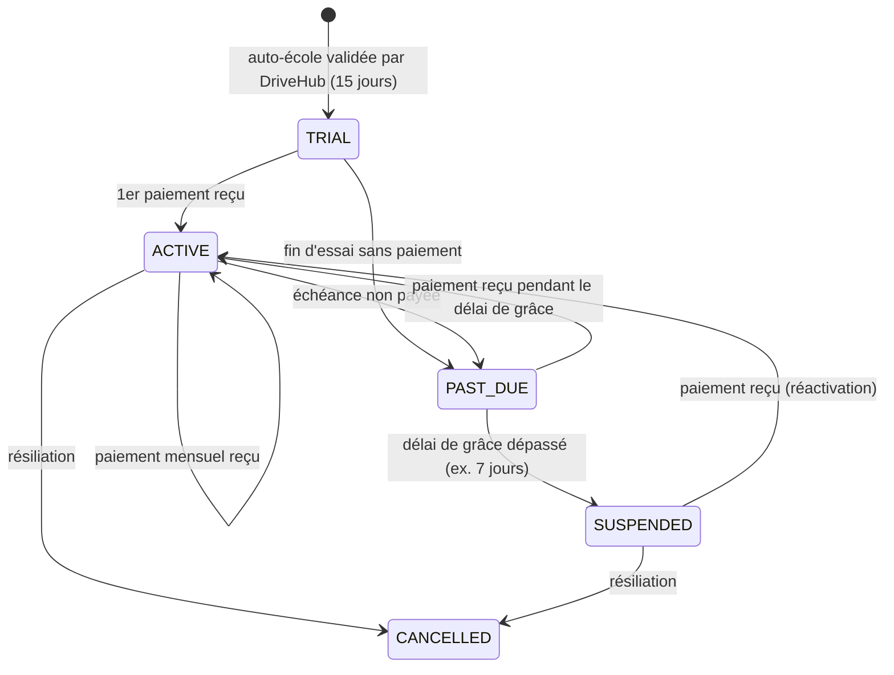
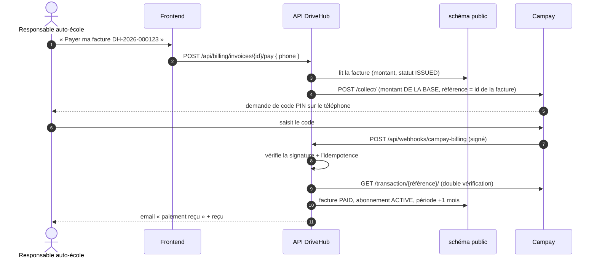

# Abonnements et facturation des auto-écoles

> **État actuel : rien n'est facturé.** Le terrain est prêt (tables, période d'essai, consultation dans le
> back-office), mais `billing.enabled=false`. Ce document explique comment la facturation fonctionnera, ce qui
> existe déjà, ce qui reste à écrire, et les règles de sécurité à respecter le jour où on l'active.

Deux flux d'argent différents, à ne pas confondre :

| Flux | Qui paie qui | Où c'est géré | État |
|------|--------------|---------------|------|
| **Paiement des élèves** | L'élève paie son auto-école (inscription, leçons) | Schéma de l'auto-école, table `payments` (voir README, « Paiement Mobile Money ») | En place (Campay ou simulé) |
| **Abonnement DriveHub** | L'auto-école paie DriveHub chaque mois | Schéma `public` : tables `subscription_*` | Préparé, désactivé |

Ce document traite uniquement du second : **c'est votre chiffre d'affaires**, la base de votre comptabilité.

---

## 1. Vocabulaire

| Terme | Signification |
|-------|---------------|
| Offre (`subscription_plans`) | Ce qu'on vend : Essentiel (25 000 FCFA/mois), Business (50 000), Sur mesure (devis) |
| Abonnement (`school_subscriptions`) | Le contrat d'UNE auto-école : quelle offre, quel statut, quelles dates |
| Période d'essai | 15 jours gratuits, démarrés automatiquement quand DriveHub valide l'auto-école |
| Période de facturation | Un mois (du 3 octobre au 2 novembre par exemple) |
| Facture (`subscription_invoices`) | Le document qui dit « l'auto-école X doit Y FCFA pour la période Z » |
| Avoir (`CREDIT_NOTE`) | Facture négative qui annule (tout ou partie) une facture. **On ne modifie et ne supprime jamais une facture.** |
| Webhook | Appel envoyé PAR Campay à notre API pour dire « le paiement a réussi / échoué » |

## 2. Cycle de vie d'un abonnement

| Statut | L'auto-école peut... |
|--------|----------------------|
| `TRIAL` | Tout faire. Un bandeau indique les jours restants (`GET /api/driving-schools/me/subscription`). |
| `ACTIVE` | Tout faire. |
| `PAST_DUE` | Tout faire, avec un bandeau « paiement en retard » et des rappels par email. |
| `SUSPENDED` | **Lire seulement** (consulter, exporter ses données). Plus de création de réservation, d'élève, etc. Ne jamais supprimer leurs données. |
| `CANCELLED` | Lecture seule pendant 90 jours (export), puis archivage selon la politique de confidentialité. |

## 3. Ce qui existe déjà

| Élément | Où | Rôle |
|---------|-----|------|
| Migration `V15__abonnements.sql` | `backend/src/main/resources/db/migration/public/` | Tables `subscription_plans` (avec les 3 offres), `school_subscriptions`, `subscription_invoices` (vide) |
| `SubscriptionService.startTrial` | `modules/subscription/domain/services/` | Appelé à l'approbation de l'auto-école : crée l'abonnement `TRIAL` de 15 jours (une seule fois) |
| `GET /api/driving-schools/me/subscription` | `SubscriptionController` | Le responsable voit son offre et les jours d'essai restants |
| `GET /api/platform/subscriptions` | `SubscriptionController` (ROOT, SUPER_ADMIN) | Le back-office voit tous les abonnements, essais qui se terminent en premier |
| `billing.*` | `application.yaml` | `enabled` (faux), `trial-days` (15), `default-plan` (ESSENTIEL) |

Les auto-écoles validées avant cette version ont reçu un essai de 15 jours à partir de la mise à jour (fin de V15).

## 4. Ce qu'il faudra écrire pour facturer (ordre conseillé)

### Étape 1 — Émettre les factures (sans encaisser)

Une tâche planifiée (`@Scheduled`, une fois par jour, à 2 h du matin) :

1. cherche les abonnements dont la période se termine (ou dont l'essai se termine) ;
2. crée la facture du mois suivant avec un **numéro séquentiel sans trou** (`DH-2026-000123`) ;
3. le montant vient **toujours de la base** (`subscription_plans.monthly_price_fcfa`), jamais du navigateur ;
4. envoie la facture par email (PDF) au responsable.

À ce stade, on peut encaisser à la main (virement, espèces) et marquer la facture payée depuis le back-office :
c'est suffisant pour démarrer, et cela permet de vérifier la numérotation et la comptabilité avant d'automatiser.

### Étape 2 — Encaisser par Mobile Money (Campay)

L'intégration Campay existe déjà pour les élèves (`CampayPaymentGateway`, `PaymentWebhookService`) : il faudra
la réutiliser avec une **référence différente** (préfixe `INV:`) pour distinguer une facture DriveHub d'un
paiement d'élève, et une route de webhook dédiée.

### Étape 3 — Relances et suspension

Tâche quotidienne : facture impayée à l'échéance → `PAST_DUE` + email J0, J+3, J+6 → `SUSPENDED` à J+7.
Un filtre (comme `TenantResolutionFilter`) refuse alors les requêtes d'écriture de cette auto-école (403 avec un
message clair « Abonnement suspendu : réglez la facture DH-... pour réactiver votre espace »).

### Étape 4 — Comptabilité dans le back-office

- Journal des ventes : liste des factures et avoirs par mois (numéro, auto-école, HT, TVA, TTC, statut).
- Encaissements : factures payées avec la référence de l'opérateur (rapprochement avec le relevé Campay).
- Export CSV pour le comptable.
- Indicateurs : revenu mensuel récurrent (MRR), nombre d'essais en cours, taux de conversion essai → payant,
  impayés.

## 5. Sécurité (à respecter absolument)

| Règle | Pourquoi | Comment |
|-------|----------|---------|
| **Le montant vient du serveur** | Un utilisateur peut modifier la requête envoyée par son navigateur | L'API lit le montant dans `subscription_invoices`, jamais dans le corps de la requête |
| **Webhook signé** | N'importe qui peut appeler l'URL du webhook | Vérifier la signature Campay (déjà fait pour les élèves, `CAMPAY_WEBHOOK_KEY`) ; refuser sinon |
| **Double vérification** | Une signature peut fuiter | Après le webhook, interroger Campay (`GET /transaction/{ref}`) et comparer montant et statut |
| **Idempotence** | Campay peut envoyer le même webhook plusieurs fois | `external_reference` est `UNIQUE` : le 2ᵉ traitement ne fait rien |
| **Factures immuables** | Obligation comptable, traçabilité | Pas d'UPDATE du montant, pas de DELETE ; une erreur se corrige par un avoir (`CREDIT_NOTE`) |
| **Numérotation sans trou** | Obligation comptable | Séquence PostgreSQL dédiée, attribuée dans la même transaction que la création |
| **Montants en entiers** | Pas d'arrondi sur des FCFA | `numeric(12,0)` + contrainte `amount_fcfa >= 0` (sauf avoir) |
| **Secrets hors du code** | Une fuite du dépôt ne doit rien révéler | `CAMPAY_*` en variables d'environnement (Render, Railway...), jamais dans Git |
| **Droits** | Seuls ROOT / SUPER_ADMIN voient l'argent | `@PreAuthorize("hasRole('ROOT') || hasRole('SUPER_ADMIN')")` sur toute route de facturation |
| **Journal** | Savoir qui a fait quoi | Chaque action manuelle (marquer payée, avoir, suspension) enregistre l'administrateur et la date |
| **Rapprochement** | Détecter un écart (paiement reçu non enregistré, ou l'inverse) | Comparer chaque semaine le relevé Campay et les factures `PAID` |

## 6. Activer la facturation (le jour venu)

1. Écrire et tester les étapes 1 à 3 ci-dessus (tests unitaires + tests d'intégration du webhook).
2. Faire valider les factures (mentions obligatoires, TVA, numéro contribuable) par un comptable.
3. Tester avec `demo.campay.net` et de petits montants.
4. Mettre `BILLING_ENABLED=true` dans l'environnement de production.
5. Prévenir les auto-écoles par email depuis le back-office (page Emails) au moins 15 jours avant la première facture.

## 7. Variables d'environnement

| Variable | Défaut | Rôle |
|----------|--------|------|
| `BILLING_ENABLED` | `false` | Active la facturation (rien n'est facturé tant qu'elle vaut `false`) |
| `BILLING_TRIAL_DAYS` | `15` | Durée de la période d'essai |
| `CAMPAY_*` | — | Identifiants Campay (déjà utilisés pour les paiements des élèves) |
