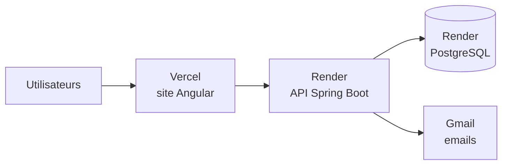

# Mettre DriveHub en ligne

**Deux comptes suffisent : Render (API + base de données) et Vercel (site). Les emails partent de votre Gmail.**
Comptez 20 à 30 minutes la première fois. Ensuite, chaque fusion sur `Develop` met tout à jour automatiquement.

| Service | Rôle | Coût indicatif |
|---------|------|----------------|
| Render | API (Starter) + base PostgreSQL (Basic 256 Mo) | environ 7 $ + 6 $ par mois |
| Vercel | Site | Gratuit |
| Gmail | Emails | Gratuit (environ 500 emails par jour) |

Les justificatifs (CNI, CAPEC) sont chiffrés et stockés dans la base : aucun service de fichiers à créer.

---

## Étape 1 : un mot de passe d'application Gmail (2 minutes)

Gmail refuse le mot de passe normal pour une application : il faut un « mot de passe d'application ».

1. Compte Google > **Sécurité** > activez la **validation en deux étapes** (si ce n'est pas déjà fait).
2. Compte Google > recherchez **« Mots de passe des applications »** > créez-en un nommé « DriveHub ».
3. Notez les 16 lettres affichées (sans les espaces) : c'est `MAIL_PASSWORD`.

## Étape 2 : Render, l'API et la base (10 minutes)

1. Créez un compte sur [render.com](https://render.com) avec votre compte GitHub.
2. **New > Blueprint** > choisissez le dépôt `driveHub` > Render lit le fichier [`render.yaml`](../render.yaml).
3. Render demande 3 valeurs :

   | Variable | À mettre |
   |----------|----------|
   | `MOCK_ROOT_USERNAME` | l'email avec lequel vous vous connecterez au back-office |
   | `MAIL_USERNAME` | votre adresse Gmail |
   | `MAIL_PASSWORD` | le mot de passe d'application de l'étape 1 |

   Tout le reste est automatique : la base PostgreSQL est créée et branchée, les clés secrètes
   (`JWT_SECRET_KEY`, `DATA_ENCRYPTION_KEY`, `MOCK_ROOT_PASSWORD`) sont générées par Render.
4. **Apply**. Après 5 à 10 minutes, ouvrez `https://drivehub-api.onrender.com/actuator/health` :
   la réponse doit être `{"status":"UP"}` (l'adresse exacte est affichée en haut de la page du service).
5. Dans le service `drivehub-api` > **Environment** :
   - relevez `MOCK_ROOT_PASSWORD` : c'est le mot de passe du back-office ;
   - copiez `DATA_ENCRYPTION_KEY` dans un gestionnaire de mots de passe (si elle était perdue,
     les justificatifs deviendraient illisibles). Ne la modifiez jamais.
6. **Settings > Deploy Hook** : copiez l'adresse. Sur GitHub, dépôt `driveHub` > **Settings > Secrets and
   variables > Actions > New repository secret** : nom `RENDER_DEPLOY_HOOK_URL`, valeur = cette adresse.
   (C'est ce qui permet à GitHub de redéployer l'API après chaque fusion.)

## Étape 3 : Vercel, le site (5 minutes)

Le projet Vercel existe déjà (`cmdrivehub.vercel.app`). Dans Vercel > projet > **Settings** :

1. **Environment Variables** : `API_URL` = l'adresse de l'API Render (ex. `https://drivehub-api.onrender.com`).
2. **Git > Production Branch** : `Develop`.
3. **Deployments** > dernier déploiement > **Redeploy**.

Si l'adresse du site n'est pas `https://cmdrivehub.vercel.app`, mettez la bonne dans Render > Environment :
`APP_FRONTEND_URL` et `CORS_ALLOWED_ORIGINS`.

## C'est en ligne

- Site : `https://cmdrivehub.vercel.app` ; back-office : `/backoffice/login` (email de l'étape 2 et `MOCK_ROOT_PASSWORD`).
- Testez : inscription d'un moniteur, email reçu (regardez aussi les spams), justificatifs, création et
  validation d'une auto-école.

## Ensuite : publier une nouvelle version

Fusionnez une pull request dans `Develop`. GitHub lance les tests ; s'ils passent, Render redéploie l'API et
Vercel redéploie le site. Si un test échoue, rien n'est publié.

## En cas de problème

| Symptôme | Que faire |
|----------|-----------|
| Le service Render redémarre en boucle | Render > Logs : le message dit quelle variable manque ou est fausse. |
| Le site s'affiche mais la connexion échoue | `API_URL` (Vercel) incorrecte, ou adresse du site absente de `CORS_ALLOWED_ORIGINS` (Render). |
| Les emails ne partent pas | Render > Logs : « Échec de l'envoi de l'email ». Vérifiez `MAIL_USERNAME` et le mot de passe d'application. |
| Les emails arrivent dans les spams | Normal au début avec Gmail ; une adresse professionnelle améliore la situation (voir EMAILS-DELIVRABILITE.md). |

## Autres options (plus tard, si besoin)

- **Serveur VPS avec Docker** : `docker compose --profile db up -d --build` (voir `docker-compose.yml`).
- **Beaucoup de justificatifs** : `STORAGE_PROVIDER=R2` (Cloudflare R2) au lieu de la base.
- **Beaucoup d'emails** (plus de 500 par jour) : un service d'envoi (Brevo...), voir EMAILS-DELIVRABILITE.md.
