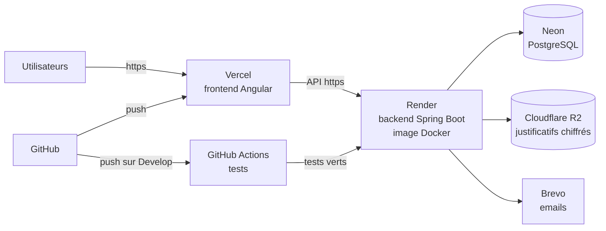

# Mettre DriveHub en ligne (première version)

Ce guide met en ligne DriveHub avec des services qui ont une offre gratuite ou peu chère, sans serveur à
administrer. Comptez **une heure**, la première fois. Une fois en place, **une fusion sur `Develop` suffit**
pour publier : la CI teste, puis le backend et le frontend sont redéployés tout seuls.



| Rôle | Service | Coût indicatif |
|------|---------|----------------|
| Frontend | Vercel | Gratuit |
| Backend | Render (offre Starter) | ~7 $ / mois (l'offre gratuite s'endort après 15 min sans visite : 1 minute d'attente au réveil) |
| Base de données | Neon | Gratuit jusqu'à 0,5 Go |
| Fichiers (justificatifs) | Cloudflare R2 | Gratuit jusqu'à 10 Go |
| Emails | Brevo | Gratuit jusqu'à 300 / jour |

Tout est interchangeable : le backend ne lit que des **variables d'environnement** (la liste complète, commentée,
est dans [`backend/.env.example`](../backend/.env.example)).

---

## 0. Développement local : la configuration dans un fichier `.env`

```bash
./scripts/init-env.sh     # crée backend/.env et génère les secrets
cd backend && ./mvnw spring-boot:run
```

Votre PostgreSQL local se règle dans `.env` :

```properties
DB_URL=jdbc:postgresql://localhost:5432/drivehubDB
DB_USERNAME=postgres
DB_PASSWORD=root
```

Le fichier `.env` n'est jamais envoyé sur GitHub. En production, on met **les mêmes noms** dans le tableau de bord
de l'hébergeur : rien d'autre ne change. (Si une variable existe à la fois dans `.env` et sur le serveur, celle du
serveur gagne.)

---

## 1. Générer les secrets (une seule fois)

```bash
openssl rand -base64 48   # -> JWT_SECRET_KEY
openssl rand -base64 32   # -> DATA_ENCRYPTION_KEY
```

Rangez-les dans un gestionnaire de mots de passe (Bitwarden, 1Password...).
**Ne changez jamais `DATA_ENCRYPTION_KEY` une fois des justificatifs enregistrés** : ils deviendraient illisibles.

## 2. Base de données : Neon

1. [neon.tech](https://neon.tech) > *New project* > région **Europe (Frankfurt)**.
2. *Connection details* > choisissez **Java** : Neon affiche une adresse `jdbc:postgresql://...?sslmode=require`.
3. Notez `DB_URL` (l'adresse sans l'utilisateur ni le mot de passe), `DB_USERNAME`, `DB_PASSWORD`.

Les tables sont créées automatiquement au premier démarrage (Flyway).

> Le mot de passe Neon communiqué au début du projet doit être **changé** (*Roles > Reset password*) :
> il a circulé en clair.

## 3. Justificatifs : Cloudflare R2

1. Tableau de bord Cloudflare > **R2** > *Create bucket* : `drivehub-documents`. **Ne pas** activer l'accès public.
2. *R2 > Manage R2 API Tokens > Create API token* : permission **Object Read & Write**, limitée à ce bucket.
3. Notez `R2_ACCOUNT_ID` (affiché sur la page R2), `R2_ACCESS_KEY_ID`, `R2_SECRET_ACCESS_KEY`.

Les fichiers sont chiffrés par le backend avant l'envoi : même avec un accès au bucket, ils sont illisibles.

## 4. Emails : Brevo

Suivez [EMAILS-DELIVRABILITE.md](EMAILS-DELIVRABILITE.md) (domaine, SPF, DKIM, DMARC). Sans cette étape,
les emails partent mais finissent souvent dans les spams.

## 5. Backend : Render

1. [render.com](https://render.com) > *New* > **Blueprint** > choisissez le dépôt GitHub `drivehub`.
   Render lit [`render.yaml`](../render.yaml) et prépare le service `drivehub-api` (Docker, Frankfurt,
   vérification de santé sur `/actuator/health`).
2. Remplissez les variables demandées (étapes 1 à 4) et :
   - `APP_FRONTEND_URL` = adresse du frontend (ex. `https://cmdrivehub.vercel.app`, ou votre domaine) ;
   - `CORS_ALLOWED_ORIGINS` = la même adresse (plusieurs adresses : séparées par des virgules) ;
   - `MOCK_ROOT_USERNAME` / `MOCK_ROOT_PASSWORD` = compte administrateur principal du back-office.
3. Premier déploiement : bouton *Manual Deploy*. Au bout de 3 à 5 minutes, ouvrez
   `https://drivehub-api.onrender.com/actuator/health` : la réponse doit être `{"status":"UP"}`.
4. *Settings > Deploy Hook* : copiez l'adresse. Sur GitHub : *Settings > Secrets and variables > Actions >
   New repository secret* : `RENDER_DEPLOY_HOOK_URL` = cette adresse.

Domaine personnalisé (ex. `api.drivehub.cm`) : *Settings > Custom Domains*, puis un enregistrement CNAME chez
votre registraire. Le certificat HTTPS est automatique.

## 6. Frontend : Vercel

1. [vercel.com](https://vercel.com) > *Add New Project* > dépôt `drivehub`.
2. **Root Directory : `frontend`**. Le reste est lu dans `frontend/vercel.json`.
3. *Environment Variables* : `API_URL` = adresse du backend (ex. `https://drivehub-api.onrender.com`).
   Elle est injectée au moment du build (`frontend/scripts/set-api-url.mjs`).
4. *Settings > Git > Production Branch* : `Develop`.
5. *Deploy*. Chaque push sur `Develop` redéploie le site ; chaque pull request reçoit une adresse d'aperçu.

## 7. CI/CD : ce qui se passe à chaque push

| Événement | Ce qui se passe |
|-----------|-----------------|
| Push sur n'importe quelle branche, pull request | **CI** (`.github/workflows/ci.yml`) : tests backend (avec une vraie base PostgreSQL) et build + tests du frontend. Résultat visible sur la pull request. |
| Push (fusion) sur `Develop` | **Deploy** (`.github/workflows/deploy.yml`) : les tests sont relancés ; s'ils passent, Render reconstruit et met en ligne le backend, et l'image Docker est publiée sur `ghcr.io`. Vercel redéploie le frontend. |
| Bouton *Run workflow* (onglet Actions > Deploy) | Redéploiement manuel. |

Règle conseillée : *Settings > Branches > Add rule* sur `Develop` : « Require status checks to pass » (cochez
les vérifications **Backend** et **Frontend**). Ainsi, aucun code qui casse les tests ne peut être publié.

## 8. Après la mise en ligne

- [ ] `https://<backend>/actuator/health` répond `UP`.
- [ ] Inscription d'un moniteur de test : l'email arrive (et pas dans les spams ; sinon, revoir l'étape 4).
- [ ] Connexion au back-office avec le compte ROOT, puis **changement du mot de passe**.
- [ ] Création d'une auto-école de test avec CNI et CAPEC, validation dans le back-office.
- [ ] Score [mail-tester.com](https://www.mail-tester.com) supérieur ou égal à 9/10.
- [ ] Sauvegardes : Neon garde un historique (restauration à un instant donné) ; notez la procédure.

## Variante : un serveur VPS avec Docker Compose

Sur un serveur Linux avec Docker (Hetzner, OVH, Contabo...) :

```bash
git clone https://github.com/Devmodjo/drivehub.git && cd drivehub
cp backend/.env.example backend/.env    # remplir ; avec la base fournie : DB_URL=jdbc:postgresql://db:5432/drivehubDB
docker compose --profile db up -d --build
```

Placez devant un proxy HTTPS (Caddy ou Nginx + Let's Encrypt). Mise à jour : `git pull && docker compose up -d --build`.

## En cas de problème

| Symptôme | Cause probable |
|----------|----------------|
| Le service Render redémarre en boucle | Variable manquante : lisez les journaux (*Logs*). Les messages indiquent laquelle (`DATA_ENCRYPTION_KEY est absente...`, `JWT_SECRET_KEY`...). |
| Le site s'affiche mais la connexion échoue (erreur réseau) | `API_URL` (Vercel) incorrecte, ou adresse du frontend absente de `CORS_ALLOWED_ORIGINS` (Render). |
| Les liens des emails mènent à `localhost` | `APP_FRONTEND_URL` non renseignée sur Render. |
| Les emails n'arrivent pas | Journaux Render : « Échec de l'envoi de l'email » + la raison ; identifiants SMTP, domaine non vérifié chez Brevo. |
| Première requête très lente | Offre gratuite Render endormie : passez à Starter. |
